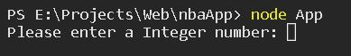
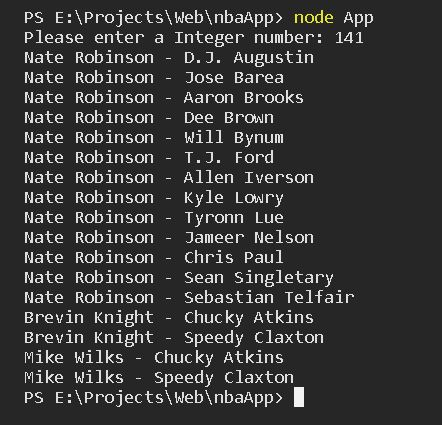

# nba_app

## Overview

This app prints on screen the pairs of NBA players whose added height in inches matches an input
from the user.

## Source API of the project

https://mach-eight.uc.r.appspot.com/

## Key topics

The following topics are covered in the
creation of the project:

- Javascript
  - Array manipulation.
- axios
  - http get request
- prompt-sync
  - Handle of input from command line
- jest
  - unit test of functions

## Requirements

In order to run the app, the following steps are required:

- Install Node and NPM

For Windows, please follow the next link:

https://phoenixnap.com/kb/install-node-js-npm-on-windows

For Linux, use the next commands:

```bash
sudo apt install nodejs
sudo apt install npm
node -v
npm -v
```

The last two lines is to verify the installation

- Install git

For Windows, use the next link:

https://git-scm.com/download/win

For Linux, use the next commands:

```bash
sudo apt-get install git
git --version
```

- Clone the repository

On the command line, write:

```bash
git clone https://github.com/ecastan960/nbaApp.git
```

- Inside the folder of the created repository, install the dependencies with the next command:

```bash
npm install
```

## How to use the app

Once everthing is installed, you can run the file as follow:

```bash
node App
```

Once this is done, the terminal ask the user for an integer to compare.



Only integers are acceptable. Strings or no input made the program to print an error on the terminal
and finished the processs. If inputs like 1.23, 1,23 and 1 23 are used, only the first number is used, in this case, 1.
If there is a match, the App prints in the terminal the pairs of players that match the input, otherwise shows 'No matches found'



## How the app works

To better understand the objective of the excersise, imagine that the user enters 140 as a number. This number means that two playes whose added height in inches are equal to 140, there is a match, for example, two players whose height are 70 inches or where one is 69 inches tall and the other is 71 in.

The data obtain has the following structure:

```json
[
  {
    "first_name": "Alex",
    "h_in": "77",
    "h_meters": "1.96",
    "last_name": "Acker"
  },
  {
    "first_name": "Hassan",
    "h_in": "76",
    "h_meters": "1.93",
    "last_name": "Adams"
  },
  {
    "first_name": "Arron",
    "h_in": "77",
    "h_meters": "1.96",
    "last_name": "Afflalo"
  },
  {
    "first_name": "Maurice",
    "h_in": "77",
    "h_meters": "1.96",
    "last_name": "Ager"
  },...
]
```

The player's information is sorted alphabetically by the last name. In order to simplify the process to find the match, a new array of
objects is created, where the key is each height in inches and the value are all the players that are just as tall. The new array would look like the following:

```javascript
table = [
  {
    height: 69,
    players: [
      {
        first_name: "Nate",
        h_in: "69",
        h_meters: "1.75",
        last_name: "Robinson",
      },
    ],
  },
  {
    height: 70,
    players: [
      {
        first_name: "Brevin",
        h_in: "70",
        h_meters: "1.78",
        last_name: "Knight",
      },
      { first_name: "Mike", h_in: "70", h_meters: "1.78", last_name: "Wilks" },
    ],
  },
  {
    height: 71,
    players: [
      {
        first_name: "Chucky",
        h_in: "71",
        h_meters: "1.8",
        last_name: "Atkins",
      },
      {
        first_name: "Speedy",
        h_in: "71",
        h_meters: "1.8",
        last_name: "Claxton",
      },
    ],
  },...
];
```

The time complexity in this case is O(n), because for every element in the source data, a operation is needed to update the new array.
In the new array, the input number is check to see which keys add up to make a match, and continue to iterate until all the matching pairs
are printed on the terminal. In the search pairs function, two for cycles are used to access every pair that match. This process is O(n) at worst with respect to the original input from the api and almost O(n^2) at worst for the new array.

- Run Tests

On the command line, write:

```bash
npm test
```
